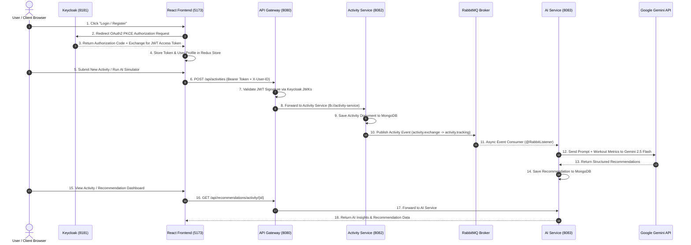
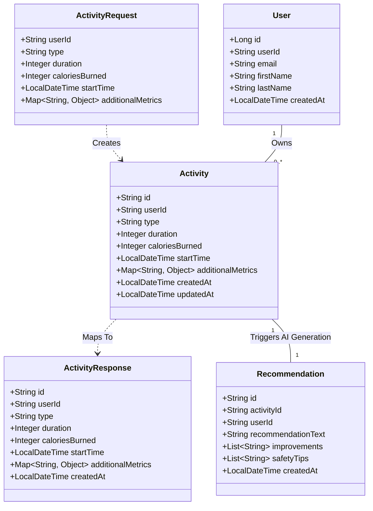

# 🩺 AI Health Recommendation System

> Most fitness apps just log your numbers. This one tells you what they mean — an event-driven microservices platform that turns workout activity into personalized AI health recommendations in real time, powered by Google Gemini.


## 🎥 Demo

<!-- PLACEHOLDER: Add live deployed link -->
🔗 **Live Demo:** [Add link here]

<!-- PLACEHOLDER: Add a short screen-recording GIF or video walkthrough -->
📹 **Video Walkthrough:** [Add video link here]

<!-- PLACEHOLDER: Add dashboard / login-flow screenshot -->


---

## 🏗️ Architecture Overview

An **event-driven microservices system** built on the Spring Cloud ecosystem, secured with Keycloak (OAuth2/PKCE), using RabbitMQ for async processing and a dual-database pattern (PostgreSQL + MongoDB).

<!-- PLACEHOLDER: Add exported architecture diagram image here (draw.io / Excalidraw / Lucidchart export) -->


### Microservice Breakdown

| Service | Port | Responsibility | Data Store / Integration |
|---|---|---|---|
| **Config Server** | `8888` | Centralized external configuration repository | Classpath file system |
| **Eureka Server** | `8761` | Service registry & dynamic discovery | In-memory registry |
| **API Gateway** | `8080` | Unified entry point, JWT verification, dynamic load balancing | Spring Cloud Gateway, Keycloak JWK certs |
| **User Service** | `8081` | User registration, profile lookup, validation | PostgreSQL (`fitness_user_db`) |
| **Activity Service** | `8082` | Logs workouts, stores metrics, publishes events | MongoDB (`fitnessactivity`), RabbitMQ (`activity.exchange`) |
| **AI Service** | `8083` | Consumes activity events, calls Gemini API, generates recommendations | MongoDB (`fitnessrecommendation`), Google Gemini 2.5 Flash |
| **Keycloak IDP** | `8181` | Identity & access management, OAuth2 PKCE grant | Keycloak Realm (`fitness-oauth2`) |
| **Frontend** | `5173` | Dashboard, activity logging, AI insight views | React 18 + Redux Toolkit, Vite, `react-oauth2-code-pkce` |

---

## 🔄 Control Flow Diagram

End-to-end request flow from login through activity submission to AI recommendation delivery.



<!-- PLACEHOLDER: Add any additional flow diagrams here (e.g. error-handling flow, retry logic) -->

---

## 🧬 UML Diagram (Data Model)



<!-- PLACEHOLDER: Add any additional diagrams here (e.g. deployment diagram, ER diagram, CI/CD pipeline) -->

---

## ✨ Features

- 🔹 **Personalized Health Recommendations** — from workout duration, calories burned, and activity type
- 🔹 **Async, Decoupled Processing** — activity logging never blocks on AI generation latency
- 🔹 **OAuth2/PKCE Authentication** — secure, industry-standard login flow via Keycloak
- 🔹 **Dual-Database Design** — relational data (users) in PostgreSQL, flexible documents (activities, recommendations) in MongoDB
- 🔹 **Dynamic Service Discovery** — all services register with Eureka and route through the gateway via load-balanced (`lb://`) URIs
- 🔹 **React Dashboard** — dark-themed SPA with manual and simulated activity logging

---

## 📡 API Endpoints

### 🔑 Authentication (Keycloak — `8181`)
| Method | Endpoint | Description |
|---|---|---|
| GET | `/realms/fitness-oauth2/protocol/openid-connect/auth` | OAuth2 PKCE authorization login endpoint |
| POST | `/realms/fitness-oauth2/protocol/openid-connect/token` | Exchanges auth code / refresh token for JWT access token |
| GET | `/realms/fitness-oauth2/protocol/openid-connect/logout` | Session invalidation and logout redirect |

### 👤 User Service (`/api/users/**` via Gateway `8080` → `8081`)
| Method | Endpoint | Headers / Body | Description |
|---|---|---|---|
| POST | `/api/users/register` | Body: `RegisterRequest` | Registers a new user in PostgreSQL |
| GET | `/api/users/{userId}` | Path: `userId` | Retrieves user profile by ID |
| GET | `/api/users/{userId}/validate` | Path: `userId` | Returns whether a user ID exists |

### 🏃 Activity Service (`/api/activities/**` via Gateway `8080` → `8082`)
| Method | Endpoint | Headers / Body | Description |
|---|---|---|---|
| POST | `/api/activities` | Header: `X-User-ID`, Body: `ActivityRequest` | Saves activity to MongoDB, publishes event to RabbitMQ |
| GET | `/api/activities` | Header: `X-User-ID` | Retrieves all activities for the authenticated user |
| GET | `/api/activities/{activityId}` | Path: `activityId` | Fetches a specific activity |
| DELETE | `/api/activities/{activityId}` | Path: `activityId` | Deletes an activity by ID |
| DELETE | `/api/activities/all` | Header: `X-User-ID` | Deletes all activities for the user |

### 🤖 AI Service (`/api/recommendations/**` via Gateway `8080` → `8083`)
| Method | Endpoint | Description |
|---|---|---|
| GET | `/api/recommendations/user/{userId}` | Retrieves all AI recommendations for a user |
| GET | `/api/recommendations/activity/{activityId}` | Retrieves the recommendation for a specific activity |

<!-- PLACEHOLDER: Link a Postman collection or Swagger/OpenAPI doc here if available -->

---

## 🔒 Security

- **OAuth2 / PKCE** via Keycloak — authorization code flow, no client secrets exposed to the frontend
- **Stateless JWT validation** at the API Gateway using Keycloak's JWK certificates — no session storage
- **Realm-based isolation** (`fitness-oauth2`) for identity management

---

## 🛠️ Tech Stack

### Backend
| Category | Technology |
|---|---|
| Language | Java 17 |
| Framework | Spring Boot 3.x |
| Microservices | Spring Cloud (Gateway, Config Server, Eureka, OpenFeign/RestTemplate for inter-service calls) |
| API Style | RESTful APIs |
| Build Tool | Maven |

### Messaging & Async Processing
| Category | Technology |
|---|---|
| Message Broker | RabbitMQ |
| Pattern | Publish/Subscribe via exchange-queue binding (`activity.exchange` → `activity.queue`) |
| Use Case | Decouples activity ingestion from AI recommendation generation |

### Authentication & Security
| Category | Technology |
|---|---|
| Identity Provider | Keycloak |
| Auth Flow | OAuth2 Authorization Code Grant with PKCE |
| Token Type | JWT (JSON Web Tokens) |
| Token Validation | Stateless validation at API Gateway via Keycloak JWK certificates |
| Frontend Auth Library | `react-oauth2-code-pkce` |

### Databases
| Category | Technology | Used By |
|---|---|---|
| Relational DB | PostgreSQL (`fitness_user_db`) | User Service — structured user profile data |
| Document DB | MongoDB (`fitnessactivity`) | Activity Service — flexible activity/workout logs |
| Document DB | MongoDB (`fitnessrecommendation`) | AI Service — AI-generated recommendation records |

### AI Integration
| Category | Technology |
|---|---|
| AI Provider | Google Gemini API |
| Model | Gemini 2.5 Flash |
| Integration Pattern | Structured prompt generation from activity metrics → AI response parsing → persistence |

### Service Discovery & Configuration
| Category | Technology |
|---|---|
| Service Registry | Netflix Eureka |
| Config Management | Spring Cloud Config Server (centralized `*.yml` configs) |
| Routing | Spring Cloud Gateway with load-balanced (`lb://`) service URIs |

### Frontend
| Category | Technology |
|---|---|
| Library | React 18 |
| State Management | Redux Toolkit |
| Build Tool | Vite |
| UI | Dark-themed dashboard, MUI Icons |
| Auth | `react-oauth2-code-pkce` (PKCE flow client) |


---

## 🚀 Setup & Installation

<!-- PLACEHOLDER: Verify/update exact commands and env vars -->
```bash
# Clone the repo
git clone https://github.com/Mahak-10/AI-Health-Recommendation-System.git

# Start infrastructure
docker compose up -d   # RabbitMQ, PostgreSQL, MongoDB, Keycloak

# Start core services (in order)
cd config-server && ./mvnw spring-boot:run
cd eureka-server && ./mvnw spring-boot:run
cd api-gateway && ./mvnw spring-boot:run
cd user-service && ./mvnw spring-boot:run
cd activity-service && ./mvnw spring-boot:run
cd ai-service && ./mvnw spring-boot:run

# Start frontend
cd frontend && npm install && npm run dev
```

**Prerequisites:** Java 17+, Maven, Node.js, Docker, Google Gemini API key

---

## 🧪 Testing

<!-- PLACEHOLDER: Mention test coverage / how to run tests -->
```bash
./mvnw test
```

---

## 🧩 Key Design Highlights

1. **Asynchronous Decoupling** — Activity ingestion is decoupled from AI processing via RabbitMQ (`activity.exchange` → `activity.queue`), keeping API response times fast even when Gemini API latency spikes.
2. **Dual-Database Pattern** — Structured relational user data lives in PostgreSQL; flexible activity logs and AI recommendations live in MongoDB, matched to each data shape.
3. **Stateless Security** — The API Gateway validates JWTs signed by Keycloak using OpenID Connect JWK certificates, with no session state to manage.

---

## 🧗 Challenges Solved

<!-- PLACEHOLDER: Add 2-3 real challenges you hit and how you solved them. Some starting points based on your architecture: -->

- **Async latency without blocking the user** — Gemini API calls can be slow/unpredictable. Solved by decoupling activity logging from AI generation via RabbitMQ, so `POST /api/activities` returns immediately while recommendation generation happens asynchronously in the background.
- **Securing service-to-service calls without shared session state** — Used stateless JWT validation at the Gateway via Keycloak's JWK certificates, so each service can independently verify a request's identity without a central session store.
- **Choosing the right database per service** — Structured, relational user data went to PostgreSQL; flexible, evolving activity/recommendation schemas went to MongoDB, avoiding a one-size-fits-all data layer.

---

## 🔮 Future Enhancements

- 📊 Real-time dashboards for user health metrics
- 🔮 Predictive analytics for early detection of potential health risks
- ⌚ Integration with wearable devices for automated data collection

---

## 👤 Author

**Mahak Singh** — [GitHub](https://github.com/Mahak-10)
