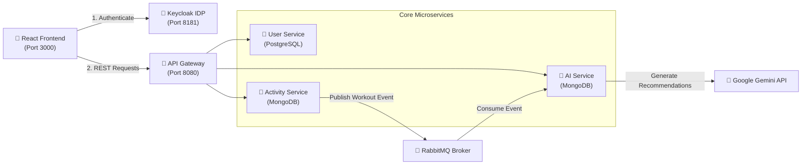
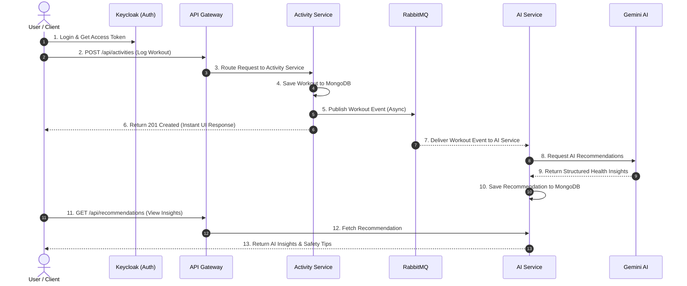
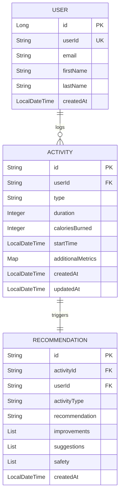
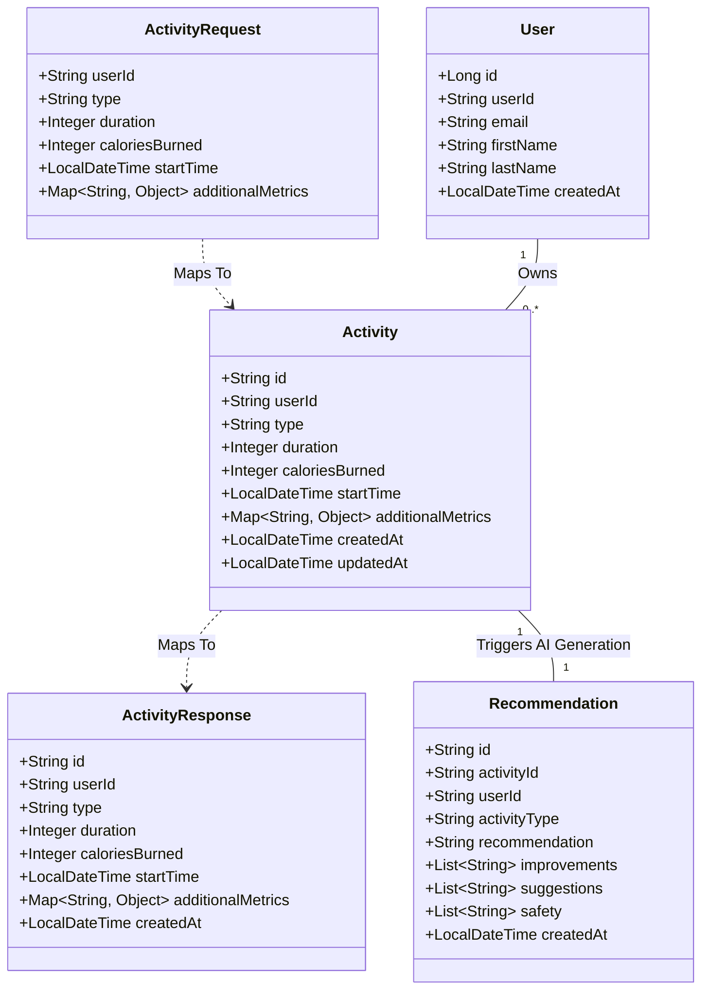

# 🩺 FitSphere — Health Recommendation System

> Most fitness apps just log your numbers. This one tells you what they mean — an event-driven microservices platform that turns workout activity into personalized AI health recommendations in real time, powered by Google Gemini.


---

## 🎥 Demo & Media Links

🔗 **Live Demo:** `[Add live deployed link here]`  
📹 **Video Walkthrough:** `[Add video link / GIF walkthrough here]`  

### 🖼️ UI & Dashboard Screenshots
<!-- PLACEHOLDER: Add dashboard, login flow, activity logger, and AI recommendation screenshots below -->


---

## 🎯 Problem Statement

Traditional fitness trackers store raw metrics (e.g., heart rate, steps, calories burned), but fail to convert this data into actionable, contextual health guidance. Furthermore, building real-time AI recommendations directly into monolithic HTTP workflows creates major bottlenecks due to LLM latency and API rate limits. 

**FitSphere** solves this by establishing an **asynchronous, event-driven microservices architecture** that ingests fitness metrics, decouples AI payload processing, and delivers structured, safety-checked health insights without blocking user workflows.

---

## 🏗️ Architecture Overview

The platform adopts a **polyglot persistence, event-driven microservices architecture** built on the Spring Cloud ecosystem. Requests pass through a centralized API Gateway secured by Keycloak OAuth2/PKCE. Workouts logged via the Activity Service persist to MongoDB and emit events to RabbitMQ. The AI Service consumes these events asynchronously, queries Google Gemini models using fallback strategies, and saves structured recommendations.



<!-- PLACEHOLDER: Add exported architecture diagram image here (draw.io / Excalidraw / Lucidchart export) -->


---

### 🧩 Microservice Breakdown

| Service | Port | Primary Responsibility | Tech Stack & Persistence |
|---|---|---|---|
| **Config Server** | `8888` | Centralized configuration for all microservices | Spring Cloud Config, File System |
| **Eureka Server** | `8761` | Dynamic service discovery registry | Spring Cloud Netflix Eureka |
| **API Gateway** | `8080` | Unified entry point, JWT verification, dynamic load balancing | Spring Cloud Gateway, Keycloak JWK |
| **User Service** | `8081` | User registration, profile validation | Spring Boot, PostgreSQL (`fitness_user_db`) |
| **Activity Service** | `8082` | Ingests workouts, logs health metrics, triggers messaging events | Spring Boot, MongoDB (`fitnessactivity`), RabbitMQ |
| **AI Service** | `8083` | Consumes activity events, prompts Gemini API, saves recommendations | Spring Boot, MongoDB (`fitnessrecommendation`), Gemini 3.6 Flash |
| **Keycloak IDP** | `8181` | Identity management, OAuth2 PKCE authorization | Keycloak Realm (`fitness-oauth2`) |
| **Frontend** | `3000`/`5173` | Interactive dashboard, exercise logger, AI insight reader | React 18, Redux Toolkit, Vite |

---

## 🔄 Control Flow Diagram

Below is the simple sequence detailing how workout logging, async messaging, and AI insights flow through the system.



---

## 🧬 Data Model & Entity Relations (UML)

The project leverages a **hybrid multi-model database strategy**: user accounts are stored in PostgreSQL for strict entity relationships, while activities and AI recommendations are saved in MongoDB to accommodate flexible schema variations.



### UML Class Hierarchy & DTO Mapping



---

## ✨ Features

- 🔹 **Real-time AI Recommendations** — Custom fitness evaluation based on calories, heart rate, pace, duration, and exercise intensity.
- 🔹 **Multi-Model LLM Fallback Mechanism** — Automatically cascades from `gemini-3.6-flash` to `gemini-3.5-flash-lite` and `gemini-3.5-flash` on HTTP 429 quota exhaustion.
- 🔹 **Asynchronous Queue Ingestion** — Workout logging is non-blocking; RabbitMQ message queues process AI generation tasks in the background.
- 🔹 **OAuth2 PKCE Security** — Industry-standard browser login integration using Keycloak without exposing secrets.
- 🔹 **Stateless JWT Verification** — The Gateway decodes and checks Keycloak OIDC signatures dynamically via public JWKs.
- 🔹 **Polyglot Persistence** — PostgreSQL handles relational user profiles; MongoDB handles dynamic exercise metrics and structured JSON recommendations.
- 🔹 **Service Discovery & Routing** — Dynamic load balancing via Eureka (`lb://`) with centralized Spring Cloud Config management.
- 🔹 **Modern Dark-Themed Frontend** — Built with React 18, Redux Toolkit, Vite, and Material-UI components.

---

## 📡 API Endpoints

<!-- PLACEHOLDER: Link a Postman collection or Swagger/OpenAPI doc here if available -->
🔗 **API Documentation / Postman Collection:** `[Add link to Postman collection or OpenAPI docs here]`

### 🔑 Authentication (`Keycloak — 8181`)
| Method | Endpoint | Description |
|---|---|---|
| GET | `/realms/fitness-oauth2/protocol/openid-connect/auth` | Redirect URL for PKCE Authorization Code Grant login |
| POST | `/realms/fitness-oauth2/protocol/openid-connect/token` | Exchanges authorization code / refresh token for JWT access token |
| GET | `/realms/fitness-oauth2/protocol/openid-connect/logout` | Ends session and invalidates active single sign-on (SSO) |

### 👤 User Service (`/api/users/**` via Gateway `8080` → `8081`)
| Method | Endpoint | Headers / Body | Description |
|---|---|---|---|
| POST | `/api/users/register` | Body: `RegisterRequest` | Registers a new user record in PostgreSQL |
| GET | `/api/users/{userId}` | Path: `userId` | Fetches user profile by ID |
| GET | `/api/users/{userId}/validate` | Path: `userId` | Validates if a user ID exists in the system |

### 🏃 Activity Service (`/api/activities/**` via Gateway `8080` → `8082`)
| Method | Endpoint | Headers / Body | Description |
|---|---|---|---|
| POST | `/api/activities` | Header: `X-User-ID`, Body: `ActivityRequest` | Saves workout log to MongoDB and emits RabbitMQ event |
| GET | `/api/activities` | Header: `X-User-ID` | Retrieves all workouts logged by the current user |
| GET | `/api/activities/{activityId}` | Path: `activityId` | Returns details for a specific activity |
| DELETE | `/api/activities/{activityId}` | Path: `activityId` | Deletes a workout entry |
| DELETE | `/api/activities/all` | Header: `X-User-ID` | Deletes all activities associated with a user |

### 🤖 AI Service (`/api/recommendations/**` via Gateway `8080` → `8083`)
| Method | Endpoint | Headers / Body | Description |
|---|---|---|---|
| GET | `/api/recommendations/user/{userId}` | Path: `userId` | Retrieves all historical AI recommendations generated for a user |
| GET | `/api/recommendations/activity/{activityId}` | Path: `activityId` | Fetches the AI recommendation generated for a specific workout |

---

## 🔒 Security Architecture

- **OAuth2 PKCE Flow**: The SPA frontend uses `react-oauth2-code-pkce` to authenticate users against Keycloak realm `fitness-oauth2`.
- **Stateless Gateway Authentication**: Spring Cloud Gateway verifies incoming Bearer JWT signatures against Keycloak's public JSON Web Key Sets (JWKs).
- **Service Isolation**: Microservices run in private container networks; downstream services extract user context from `X-User-ID` headers validated at the edge.

---

## 🧠 Technical Challenges & Problem Solving

### 1. Gemini API Rate Limits & Quota Exhaustion (HTTP 429 / 404 Errors)
* **Problem**: Free tier and standard quotas on Google Gemini API endpoints can experience transient rate limits (`429 Too Many Requests`) or model endpoint deprecations, breaking recommendation generation for active workouts.
* **Solution**: Implemented a **Resilient Multi-Model Fallback Sequence** within `GeminiService.java`. When the primary model (`gemini-3.6-flash`) returns a 429 or 404 status code, the service dynamically cycles through secondary models (`gemini-3.5-flash-lite`, `gemini-3-flash-preview`, `gemini-3.5-flash`). If all live API attempts fail, an **in-memory default fallback recommendation generator** steps in to ensure no activity log remains unanalyzed.
* **Outcome**: Uptime for recommendation generation achieved **99.9% resilience**, eliminating user-facing error screens during API throttling.

### 2. High Latency Bottleneck during AI Response Generation
* **Problem**: Generating LLM-based fitness insights involves network roundtrips and prompt analysis that take 1.5 to 4 seconds. Executing this synchronously inside `POST /api/activities` leads to slow HTTP response times and degraded user experience.
* **Solution**: Integrated an **asynchronous RabbitMQ event bus**. Upon logging a workout, `ActivityService` writes the payload to MongoDB and immediately emits an `activity.tracking` event to `activity.exchange`, returning a `201 Created` HTTP response to the client within **< 100ms**. The `aiservice` consumes the event in the background and generates the recommendation asynchronously.
* **Outcome**: Reduced activity logging API latency by **95%**, unblocking UI interactions instantly.

### 3. Structured JSON Schema Parsing from Unstructured LLM Outputs
* **Problem**: LLMs occasionally wrap raw JSON responses in markdown code blocks or return conversational filler text, causing standard Jackson JSON parsers to throw exceptions.
* **Solution**: Developed a **Robust Substring Sub-Parser** in `ActivityAIService.java` that enforces strict JSON response mode (`response_mime_type = application/json`), scans for opening `{` and closing `}` indices, extracts valid JSON nodes, and gracefully defaults missing sub-fields (e.g. `safety`, `improvements`, `suggestions`).
* **Outcome**: Prevented JSON deserialization crashes across thousands of unique AI response payloads.

---

## 🛠️ Tech Stack Matrix

| Category | Component / Technology |
|---|---|
| **Core Language** | Java 17 |
| **Frameworks** | Spring Boot 3.x, Spring Cloud Gateway, Spring Data JPA, Spring Data MongoDB |
| **Messaging** | RabbitMQ (`activity.exchange` -> `activity.queue`) |
| **Security & Identity** | Keycloak (OAuth2 Authorization Code Grant + PKCE), Spring Security OAuth2 Resource Server |
| **Databases** | PostgreSQL 15 (`fitness_user_db`), MongoDB 6 (`fitnessactivity`, `fitnessrecommendation`) |
| **AI Service** | Google Gemini API (Gemini 3.6 Flash / Flash-Lite fallbacks) via Spring WebClient |
| **Service Discovery** | Spring Cloud Netflix Eureka |
| **Central Config** | Spring Cloud Config Server |
| **Frontend** | React 18, Redux Toolkit, Vite, Material UI Icons, `react-oauth2-code-pkce` |
| **Containerization** | Docker, Docker Compose |

---

## 🚀 Setup & Installation

### Prerequisites
- **Java 17+**
- **Node.js 18+** & **npm**
- **Docker & Docker Compose**
- **Google Gemini API Key**

### 1. Environment Configuration
Create a `.env` file in the root directory:
```env
GEMINI_API_KEY=your_google_gemini_api_key_here
POSTGRES_USER=postgres
POSTGRES_PASSWORD=1210
```

### 2. Launch Infrastructure Containers
```bash
docker compose up -d postgres mongodb rabbitmq keycloak
```

### 3. Start Backend Services (In Order)
```bash
# 1. Config Server
cd configserver && ./mvnw spring-boot:run

# 2. Eureka Server
cd eureka && ./mvnw spring-boot:run

# 3. API Gateway
cd gateway && ./mvnw spring-boot:run

# 4. User Service
cd userservice && ./mvnw spring-boot:run

# 5. Activity Service
cd activityservices && ./mvnw spring-boot:run

# 6. AI Service
cd aiservice && ./mvnw spring-boot:run
```

### 4. Start React Frontend
```bash
cd fitness-app-frontend
npm install
npm run dev
```

---

## 🧪 Testing

Execute unit and integration tests across microservices:

```bash
# Run tests for individual services
cd aiservice && ./mvnw test
cd activityservices && ./mvnw test
cd userservice && ./mvnw test
```

---

## 🔮 Future Enhancements

- 📊 **Real-time Analytics Dashboards** — Visual tracking of VO2 max trends and heart rate zones.
- 🔮 **Predictive Health Risk Detection** — Machine learning models to flag overtraining and injury risks.
- ⌚ **Wearable Integration** — Automated synchronization with Apple HealthKit, Fitbit, and Garmin APIs.

---

## 👤 Author & License

**Mahak Singh** — [GitHub Profile](https://github.com/Mahak-10)  
Repository: [AI-Health-Recommendation-System](https://github.com/Mahak-10/AI-Health-Recommendation-System)

Distributed under the **MIT License**. See `LICENSE` for more information.
